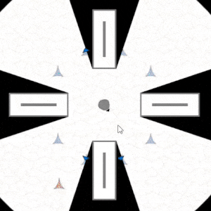

# Untitled Game #

A work in progress game about light and shadows.

## Development Screenshots ##

## Tools ##

The game is built with [phaser](http://phaser.io/), [babel](https://babeljs.io/), [webpack](https://webpack.js.org/), [preact](https://preactjs.com/) and [mobx](https://github.com/mobxjs/mobx).

## Start the game ##
Using npm run-script ...
Example
npm run-script clean build
Detail command from package.json

1. Starting-point
Project này được build bằng webpack + babel - code build với 2 thư viện là preact+mobx và phaser-io
- Starting-point của project sẽ được follow theo cách build của webpacke
Bắt đầu với webpack.config.js 
Chi tiết trong file webpack này sẽ chỉ ra entry + output khi build webpack 
    mode: "development",
    context: path.resolve(__dirname, "src"),
    entry: "./js/main.js",
    cache: true,
    output: {
      path: path.resolve(__dirname, "public"),
      filename: "main.js"
    },

- File chính main.js được add vào index.html thông qua cơ chế của webpack - cụ thể 
Sử dung HTMLWebpackPlugin thì có thể khai báo được file index.html cần để chèn file js vào 
    plugins: [
      new webpack.DefinePlugin({
        PRODUCTION: argv.mode !== "development"
      }),

      new HTMLWebpackPlugin({ template: "./index.html" }),